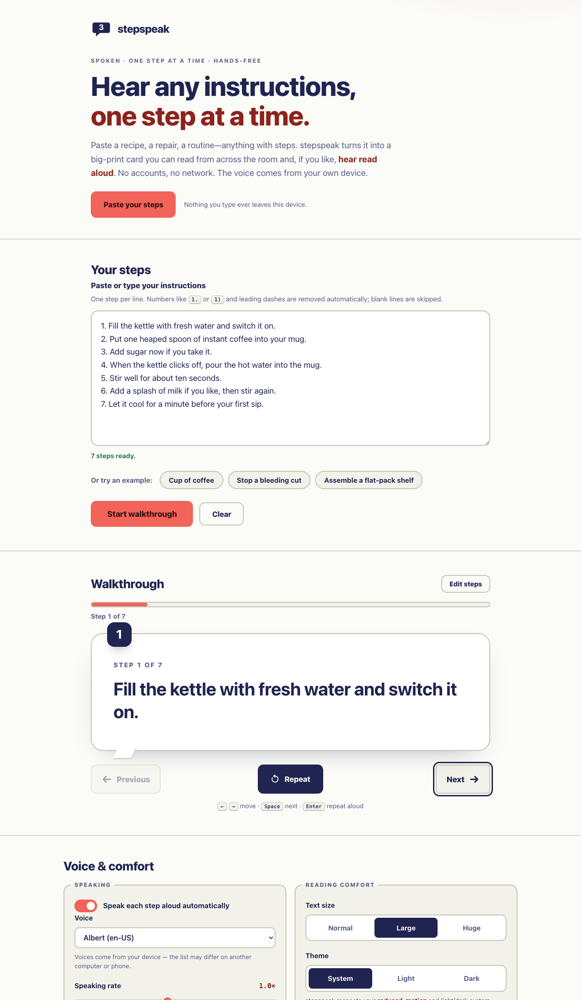

# stepspeak

**Hear any instructions, one step at a time.** Paste a recipe, a repair, or a routine and stepspeak turns it into a hands-free walkthrough: one big-print step on screen at a time, read aloud by your device's own voice. 100% client-side, zero dependencies, works fully offline.

## Why

Following written instructions while your hands are busy — kneading dough, holding a wrench, comforting a child — is genuinely hard. So is reading a wall of small numbered text if your eyesight isn't what it was. Most "read aloud" tools dump the whole page at you in one go, or need an account, or send your text off to a server.

stepspeak does one thing well: it shows you a single, large step at a time and reads just that step out loud, then waits for you. You move forward with a button, the arrow keys, or the space bar. It's a small, honest accessibility tool for anyone who'd rather listen than squint — and it never sends your text anywhere.

## Features

- **One step at a time** — a big speech-bubble card shows "Step 3 of 8" and just that step, in very large type you can read across the room.
- **Reads it aloud** — each step is spoken with your device's built-in voices via the browser's own speech synthesis. Auto-speak can be turned off if you only want big print.
- **Smart splitting** — paste anything; stepspeak splits on line breaks and strips leading list markers like `1.`, `1)`, or `-`. Blank lines are ignored.
- **Full keyboard control** — Left/Right arrows or Space to move, Enter to repeat the current step aloud. Every control is a real, focusable button.
- **Voice, rate & pitch** — pick from the voices installed on your device and slow the reading down as much as you like.
- **Reading comfort** — three text sizes, and light / dark themes that can follow your system. Reduced-motion is respected.
- **Built-in examples** — a cup of coffee, stopping a bleeding cut, and assembling a flat-pack shelf, so it works the moment you open it.
- **Remembers you** — your last list and settings are saved in your browser for next time.

## Quickstart

Just open `index.html` in any modern browser — no build step, no server, no install.

- **Local:** double-click `index.html`, or run a static server in the folder.
- **Hosted:** **[Open stepspeak live](https://sreenivas-sadhu-prabhakara.github.io/stepspeak/)**

Paste your steps (or tap an example), press **Start walkthrough**, and use the buttons or arrow keys to move through them.

## A note on voices

The spoken output uses the speech voices that are already installed on your computer or phone — stepspeak doesn't ship any of its own and doesn't download any. Because of that:

- The list of voices, and their quality, **varies by browser and operating system**.
- On first load the list can look empty for a moment while the browser fetches its voices; it fills in shortly.
- If your device has **no** speech voices at all, the large-print stepper still works perfectly — it just stays silent.

## Privacy

stepspeak is built to be trustworthy with whatever you paste into it.

- A strict Content-Security-Policy sets `connect-src 'none'`: the app **cannot** make a network request even if it tried.
- No external fonts, scripts, images, or analytics. Everything is self-contained in this one folder.
- Speech is produced locally by your device. Nothing you type is ever transmitted; your last list and settings live only in this browser's local storage.
- With no network dependencies, it keeps working with **no connection at all**.

## Accessibility

Accessibility isn't a feature bolted on here — it's the whole point.

- Semantic landmarks and a logical heading order, with a skip link.
- Every control is a real `<button>` or labelled input — never a clickable `
` — with a visible focus ring.
- An `aria-live` status region announces the current step ("Step 3 of 8, …") to screen readers as you move.
- Full keyboard operation; large touch targets; WCAG 2.2 AA contrast as a floor, aiming higher.
- Honors `prefers-reduced-motion` and `prefers-color-scheme` (light and dark).

## Disclaimer

stepspeak is a general-purpose reading and accessibility aid provided for convenience only. It reads back exactly what you paste and can mis-split or mis-pronounce unusual text. It is **not** a medical, legal, engineering, or safety device and must **not** be relied on for safety-critical or medical procedures. Always verify instructions against their original source. This software is provided under the MIT License, "as is", without warranty of any kind; the author accepts no liability for any loss, injury, or damage arising from its use. Use at your own risk.

## License

[MIT](./LICENSE) © 2026 Sreenivas Sadhu Prabhakara
